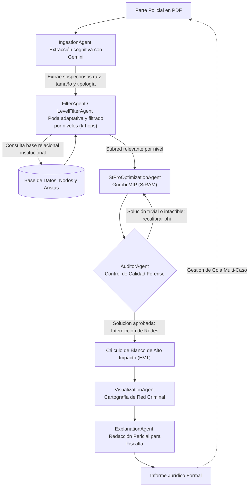

# MINISTERIO PÚBLICO | FISCALÍA DE CHILE

## Plataforma Multi-Agente Autónoma de Inteligencia Criminal y Desarticulación de Redes Delictivas (HeredIA)

Sistema inteligente de apoyo a la toma de decisiones para la **Unidad de Análisis Criminal y Focos Investigativos del Ministerio Público**, fundamentado en la convergencia de:
- **Arquitectura Multi-Agente (MAS)** orquestada mediante grafos de estado en **LangGraph**.
- **Modelos de Lenguaje Avanzados (LLMs)** mediante **Google Gemini** para la ingesta cognitiva de partes policiales y la redacción pericial jurídica formal.
- **Teoría de Grafos y Análisis de Redes Complejas (CNA)** implementado sobre **NetworkX**.
- **Optimización Matemática Lineal Entera Mixta (MIP)** resuelta con **Gurobi** (modelos de Árboles de Steiner Ponderados - *StRAM/KsRAM*).
- **Despliegue Seguro Contenerizado en Docker** para garantizar la soberanía, confidencialidad y cadena de custodia de la información procesal sensible (*On-Premise*).

---

## 1. Arquitectura y Grafo de Flujo Multi-Agente

El sistema opera mediante un **Grafo Dirigido Cíclico en LangGraph**, incorporando bucles de retroalimentación, calibración adaptativa de parámetros y control de calidad pericial:



---

## 2. Agentes Especializados del Ecosistema

1. **`IngestionAgent` (`src/agents/Ingestion_Agent.py`)**:
   - Analiza partes policiales en PDF y extrae de forma estructurada los imputados principales (nodos raíz), tamaño estimado de la organización y metadatos forenses.
   - Genera resúmenes estructurados en `data/resumenes_casos/`.

2. **`FilterAgent` / `LevelFilterAgent` (`src/agents/Filter_Agent.py`)**:
   - **Poda Criminológica:** Preserva delitos conexos (armas, receptación) y descarta ruido no relacionado.
   - **Protección de Puentes:** Blindaje de puntos de articulación (`nx.articulation_points`) para no fragmentar prematuramente la red.
   - **Segmentación por Niveles ($k$-hops):**
     - **Nivel 1 (1 Salto):** Contacto directo y coautores inmediatos del parte.
     - **Nivel 2 (2 Saltos - Recomendado):** Célula operativa cercana y testaferros.
     - **Nivel 3 (3 Saltos):** Estructura criminal ampliada, financistas y proveedores.

3. **`StProOptimizationAgent` (`src/agents/Optimization_Agent.py`)**:
   - Resuelve la formulación de Árboles de Steiner Ponderados (**StPro / StRAM**) en **Gurobi**.
   - Incorpora bucle adaptativo de calibración automática del parámetro $\phi$.

4. **`AuditorAgent` (`src/agents/Auditor_Agent.py`)**:
   - **Auditoría Forense:** Valida que la solución sea conexa, no-trivial y consistente con el reporte policial.
   - **Interdicción Táctica (*Network Interdiction*):** Simula la remoción individual de cada sospechoso para identificar al **Blanco de Alto Impacto (HVT - High-Value Target)**, cuya detención causa la máxima desarticulación de la banda.

5. **`VisualizationAgent` (`src/agents/Visualization_Agent.py`)**:
   - Genera diagramas de red en alta resolución (`data/graficos_resultados/`) y paneles comparativos multinivel de 3 columnas.

6. **`ExplanationAgent` (`src/agents/Explanation_Agent.py`)**:
   - Redacta informes periciales formales con fundamentación táctica y jurídica (`data/informes_fiscalia/`) para sustentar órdenes de detención y allanamientos ante el Tribunal de Garantía.

7. **`Copiloto HeredIA` (`demo_orquestador_interactivo.py` / `streamlit_app.py`)**:
   - Asistente conversacional institucional con *Tool-Calling*, memoria multi-caso persistente y tolerancia avanzada a errores tipográficos (*fuzzy matching*).

---

## 3. Despliegue Oficial con Docker (Estándar de Entrega)

La plataforma se entrega empaquetada en un contenedor **Docker** para garantizar aislamiento perimetral, confidencialidad de datos sensibles y portabilidad inmediata sin requerir configuración de software en los equipos del Ministerio Público.

### Requisitos Previos:
- Tener instalado **Docker Desktop** (en Windows o macOS) o el motor **Docker Engine** (en Linux).

### Paso 1: Configurar Credenciales (`.env`)
Verifique que el archivo `.env` en la raíz del proyecto contenga su clave de API de **Google Gemini**:
```env
GOOGLE_GENAI_API_KEY="tu_api_key_de_gemini"
```
> *Nota: Si no dispone de conexión o clave API, el sistema activa automáticamente su modo local/predictivo de respaldo para garantizar la continuidad operativa.*

### Paso 2: Iniciar la Aplicación (1-Clic)

#### En Windows:
Haga doble clic en el archivo:
```text
iniciar_con_docker.bat
```
O ejecute en PowerShell / CMD:
```powershell
docker-compose up --build -d
```

#### En Linux / macOS:
Ejecute en la terminal:
```bash
./iniciar_con_docker.sh
```
O directamente:
```bash
docker-compose up --build -d
```

### Paso 3: Acceso a la Plataforma
El navegador se abrirá automáticamente (o puede ingresar manualmente) en:
👉 **`http://localhost:8501`**

### Paso 4: Detener la Plataforma
Cuando finalice la sesión, ejecute en la terminal:
```powershell
docker-compose down
```
O detenga el contenedor `heredia_fiscalia_app` desde la interfaz de Docker Desktop.

> **Persistencia y Seguridad de Datos:** Todos los partes policiales subidos (`data/reportes/`), diagramas generados (`data/graficos_resultados/`) e informes periciales (`data/informes_fiscalia/`) se sincronizan en tiempo real con su computadora anfitriona mediante volúmenes montados seguros.

---

## 4. Manual de Operación del Dashboard Web (Streamlit)

La interfaz se divide en **5 módulos operativos**:

1. **Copiloto HeredIA (Asistente Interactivo):**
   - Chat en lenguaje natural para realizar consultas criminológicas (*ej. "¿quiénes son los sospechosos?", "optimiza en nivel 2", "evalúa el blanco HVT"*).
   - Botones de acción rápida institucional.

2. **Red Criminal & Blanco HVT:**
   - Visualizador del diagrama de la red criminal aislada.
   - Justificación táctica de neutralización del **Blanco Prioritario (HVT)**.
   - Tabla de integrantes de la célula con prioridad procesal (Órdenes de Detención vs. Seguimiento).

3. **Análisis Comparativo Multinivel:**
   - Ejecución y visualización en paralelo de la expansión de la red a 1, 2 y 3 saltos topológicos desde el imputado raíz.
   - Cuadro comparativo de utilidad procesal para formalizaciones por Asociación Ilícita o Lavado de Activos.

4. **Informe Pericial Formal (Tribunal):**
   - Vista previa del informe pericial formal emitido para el Fiscal Adjunto.
   - **Botón de descarga directa en 1 clic (`.txt`)**.

5. **Procesamiento Automatizado en Lote:**
   - Ejecución desatendida sobre todos los partes policiales en cola en Nivel 1, Nivel 2 o Multinivel.
   - Tabla de seguimiento del estado de cada expediente.

---

## 5. Estructura del Proyecto

```text
TESIS_FISCALIA/
│
├── docker-compose.yml              # Configuración de servicios Docker y volúmenes persistentes
├── Dockerfile                      # Entorno estandarizado (Python 3.11 + Graphviz)
├── .dockerignore                   # Exclusión de temporales
├── iniciar_con_docker.bat          # Lanzador oficial 1-Clic para Windows
├── iniciar_con_docker.sh           # Lanzador para Linux/macOS
├── requirements.txt                # Dependencias exactas del sistema
├── streamlit_app.py                # Dashboard web institucional formal (Streamlit)
├── demo_orquestador_interactivo.py # Motor del Copiloto HeredIA y memoria multi-caso
├── main.py                         # Punto de entrada general por consola
├── generar_reportes_demo.py        # Generador de partes policiales de prueba
├── .env                            # Variables de entorno (API Key)
├── README.md                       # Documentación técnica y manual de usuario
│
├── data/
│   ├── reportes/                   # Partes policiales en PDF de entrada
│   ├── resumenes_casos/            # Resúmenes cognitivos estructurados
│   ├── graficos_resultados/        # Cartografía y diagramas de red generados (PNG)
│   ├── informes_fiscalia/          # Informes periciales formales (TXT / MD)
│   ├── nodes.csv                   # Base de datos institucional de sospechosos
│   ├── edges.csv                   # Base de datos de vínculos delictivos
│   └── true_nodes.csv              # Ground Truth de validación
│
└── src/
    ├── agents/                     # Los 6 agentes autónomos del sistema
    ├── graph/                      # Grafos de estado LangGraph
    └── utils/                      # Modelos matemáticos Gurobi y utilidades
```

---

## 6. Entregables y Productos de Salida

Tras la ejecución del sistema, los productos procesales se almacenan automáticamente en:
- **Diagramas de Redes Criminales:** `data/graficos_resultados/` (PNG)
- **Informes Forenses para Fiscalía:** `data/informes_fiscalia/` (TXT / MD)
- **Resúmenes Cognitivos de Casos:** `data/resumenes_casos/` (TXT)
- **Dashboard Web de Control:** Accesible en `http://localhost:8501`