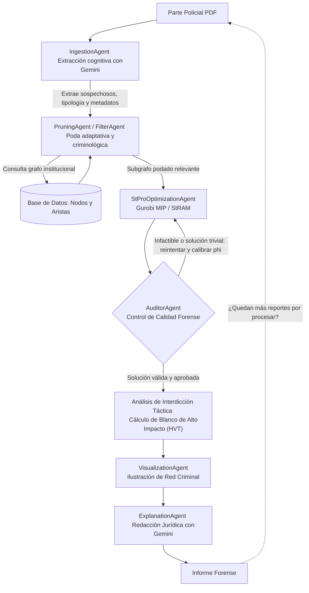

# TESIS_FISCALIA

## Sistema Multi-Agente Autónomo para Detección, Análisis y Desarticulación de Redes Criminales

Sistema inteligente de apoyo a la toma de decisiones para el **Ministerio Público / Fiscalía**, fundamentado en la convergencia de:
- **Arquitectura Multi-Agente (MAS)** orquestada mediante **LangGraph**.
- **Modelos de Lenguaje Avanzados (LLMs)** mediante **Google Gemini** para la ingesta cognitiva y redacción forense.
- **Teoría de Grafos y Análisis de Redes Complejas (CNA)** implementado en **NetworkX**.
- **Optimización Matemática Lineal Entera Mixta (MIP)** resuelta con **Gurobi** (modelos de Árboles de Steiner Ponderados - *StRAM/KsRAM*).

---

## 1. Grafo Cíclico del Workflow Multi-Agente

El flujo opera mediante un **Grafo Dirigido Cíclico** con bucles de retroalimentación, autocorrección de parámetros matemáticos y gestión de colas de casos:



---

## 2. Agentes Especializados del Ecosistema

1. **`IngestionAgent` (`src/agents/Ingestion_Agent.py`)**:
   - Lee partes policiales en PDF y extrae sospechosos clave (RUTs/IDs raíz), tamaño estimado de la banda y metadatos forenses usando **Google Gemini**.
   - Genera resúmenes forenses en `data/resumenes_casos/`.

2. **`PruningAgent` (`src/agents/Filter_Agent.py`)**:
   - **Poda Adaptativa:** Si $N \le 50$, preserva delitos conexos (receptación de autos, armas); si $N > 50$, activa poda por $k$-hops y afinidad delictiva descartando delitos disonantes (fraudes/estafas menores).
   - **Protección de Puentes:** Blindaje de puntos de articulación (`nx.articulation_points`) para evitar fracturar la red.

3. **`StProOptimizationAgent` (`src/agents/Optimization_Agent.py`)**:
   - Resuelve el modelo StPro (`StRAM`) en **Gurobi**.
   - Incorpora bucle adaptativo de calibración de $\phi$ ante soluciones triviales.

4. **`AuditorAgent` (`src/agents/Auditor_Agent.py`)**:
   - **Control de Calidad:** Valida no-trivialidad del grafo resultante por la optimización ($|V_{\text{banda}}| > 1$), comparación de tamaño frente al reporte y coherencia de riesgo ($\Delta\text{PCG}$).
   - **Interdicción de Redes (*Network Interdiction*):** Simula la remoción individual de cada sospechoso para identificar al **Blanco de Alto Impacto (HVT - High-Value Target)** cuya captura quiebra la conectividad de la banda y facilita la desarticulación del grupo.

5. **`VisualizationAgent` (`src/agents/Visualization_Agent.py`)**:
   - Genera representaciones visuales (`data/graficos_resultados/`) destacando nodos raíz, banda aislada y entorno.

6. **`ExplanationAgent` (`src/agents/Explanation_Agent.py`)**:
   - Redacta el informe forense formal (`data/informes_fiscalia/`) para el fiscal adjunto, integrando la estrategia HVT.

7. **`Copiloto HeredIA` (`demo_orquestador_interactivo.py`)**:
   - Asistente conversacional inteligente basado en **LangGraph + Gemini** con arquitectura *Tool-Calling*. Permite interactuar mediante chat en lenguaje natural para solicitar diligencias, consultas a la base de datos, optimización y peritajes de forma dinámica.

---

## 3. Estructura del Repositorio

```text
TESIS_FISCALIA/
│
├── data/
│   ├── reportes/                     # Partes policiales en PDF de entrada
│   ├── resumenes_casos/              # Resúmenes forenses en TXT generados por Gemini
│   ├── graficos_resultados/          # Gráficos PNG de las redes detectadas
│   ├── informes_fiscalia/            # Informes formales redactados para Fiscalía
│   ├── nodes.csv                     # Base de datos de sospechosos (id, pcg, label)
│   ├── edges.csv                     # Base de datos de vínculos (source, target, distance)
│   └── true_nodes.csv                # Ground Truth para validación
│
├── src/
│   ├── agents/
│   │   ├── Ingestion_Agent.py        # Ingesta cognitiva de reportes policiales con LLM
│   │   ├── Filter_Agent.py           # PruningAgent (Poda adaptativa y criminológica)
│   │   ├── Optimization_Agent.py     # StProOptimizationAgent (Gurobi StRAM adaptativo)
│   │   ├── Auditor_Agent.py          # AuditorAgent (Control de calidad y cálculo HVT)
│   │   ├── Visualization_Agent.py    # Generación de gráficos de red
│   │   └── Explanation_Agent.py      # Redacción de informes jurídicos formales con IA
│   │
│   ├── graph/
│   │   └── workflow.py               # Orquestador del grafo de estados en LangGraph
│   │
│   ├── utils/
│   │   ├── models_STRAM_KsRAM.py     # Formulaciones matemáticas en Gurobi (StRAM, KsRAM, RGEN)
│   │   └── metrics.py                # Módulo utilitario de métricas
│   │
│   └── database/                     # Módulos de persistencia y consultas institucionales
│
├── demo_orquestador_interactivo.py   # Orquestador conversacional interactivo (Copiloto HeredIA)
├── generar_reportes_demo.py          # Generador de partes policiales de prueba en PDF
├── main.py                           # Punto de entrada y ejecución batch del pipeline
├── requirements.txt                  # Dependencias del proyecto
├── .env                              # Variables de entorno (claves API de Google Gemini / Gurobi)
└── README.md                         # Documentación oficial del proyecto
```

---

## 4. Guía de Instalación y Demostración Local

Seguir estos pasos para clonar, instalar y ejecutar la demostración completa en su computadora:

### Paso 1: Clonar el Repositorio
Abra una terminal (PowerShell, CMD o Bash) y clone el repositorio:
```bash
git clone https://github.com/tu-usuario/TESIS_FISCALIA.git
cd TESIS_FISCALIA
```

### Paso 2: Crear y Activar el Entorno Virtual

- **En Windows (PowerShell):**
  ```powershell
  python -m venv venv
  .\venv\Scripts\activate
  ```

- **En macOS / Linux:**
  ```bash
  python3 -m venv venv
  source venv/bin/activate
  ```

### Paso 3: Instalar Dependencias
```bash
pip install -r requirements.txt
```

### Paso 4: Configurar Variables de Entorno (`.env`)
Abra el archivo `.env` en la raíz del proyecto y configure su clave de API de **Google Gemini**:
```env
GOOGLE_GENAI_API_KEY="tu_api_key_de_gemini"
```
> **Nota:** Si no tiene una clave API al momento de ejecutar, el sistema cuenta con un modo de demostración autónomo de respaldo para asegurar la continuidad de la prueba sin interrupciones. Para crear una API de gemini, ir a https://aistudio.google.com y crear un proyecto y crear la clave de API.

---

## 5. Ejecución de la Demostración

### A. Generar los Partes Policiales de Prueba (PDF)
Genere los partes policiales sintéticos en `data/reportes/`:
```bash
python generar_reportes_demo.py
```
*Salida esperada:*
```text
[OK] Parte policial 1 generado en: data/reportes/parte_policial_caso_banda_norte.pdf
[OK] Parte policial 2 generado en: data/reportes/parte_policial_caso_desarme_vehiculos.pdf
```

### B. Demostración Interactiva con el Copiloto HeredIA (LangGraph)
Inicie el asistente conversacional multi-agente en terminal:
```bash
python demo_orquestador_interactivo.py
```

Al iniciar el Copiloto, puede interactuar en lenguaje natural en el prompt `[Usuario]:`:

```text
===========================================================================
 COPILOTO HEREDIA - SISTEMA MULTI-AGENTE DE INTELIGENCIA CRIMINAL
 Orquestador: Google Gemini LLM + LangGraph
===========================================================================
 Caso cargado: parte_policial_caso_banda_norte
 Escriba en lenguaje natural, por ejemplo:
   - 'Dime quienes eran los sospechosos'
   - 'Aisla la banda con Gurobi'
   - '¿Cual es el blanco HVT prioritario para detener?'
   - 'Genera el grafico y el informe formal'
   - 'Ejecuta todo el pipeline'
   (o responder 'si', 'dale', 'ok' a las sugerencias del agente)
   (o escribir 'salir' para terminar)
===========================================================================

[Usuario]: dime quienes eran los sospechosos
```

#### Ejemplos de Consultas en Lenguaje Natural:
| Consulta del Usuario | Acción Ejecutada por el Sistema Multi-Agente |
| :--- | :--- |
| `dime quienes eran los sospechosos` | `IngestionAgent` analiza el PDF con Gemini y extrae los líderes y metadatos del caso. |
| `aisla la banda con gurobi` | `OptimizationAgent` consulta la base relacional y resuelve el modelo StRAM en Gurobi. |
| `¿cual es el blanco HVT prioritario?` | `AuditorAgent` evalúa la fragilidad del grafo y calcula el Blanco de Alto Impacto (HVT). |
| `genera el grafico y el informe` | `VisualizationAgent` y `ExplanationAgent` exportan los diagramas e informes formales. |
| `ejecuta todo el pipeline` | Invoca el `StateGraph` de LangGraph corriendo todo el flujo autónomo de principio a fin. |
| `listar casos` / `cargar caso 2` | Lista los partes policiales en cola o cambia de caso de investigación. |
| `salir` | Finaliza la sesión del Copiloto. |

---

### C. Ejecución Batch Autónoma Tradicional
Para ejecutar todo el pipeline de manera desatendida sobre todos los reportes de la cola:
```bash
python main.py
```

---

## 6. Entregables y Productos de Salida

Tras la ejecución, los resultados se almacenan automáticamente en:
- **Diagramas de Redes Criminales:** `data/graficos_resultados/` (PNG)
- **Informes Forenses para Fiscalía:** `data/informes_fiscalia/` (TXT)
- **Resúmenes Cognitivos de Casos:** `data/resumenes_casos/` (TXT)